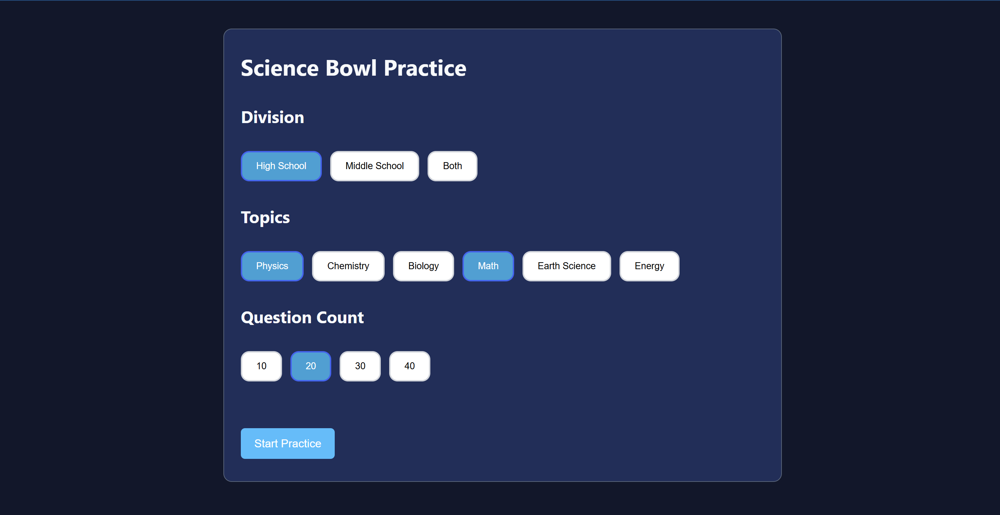
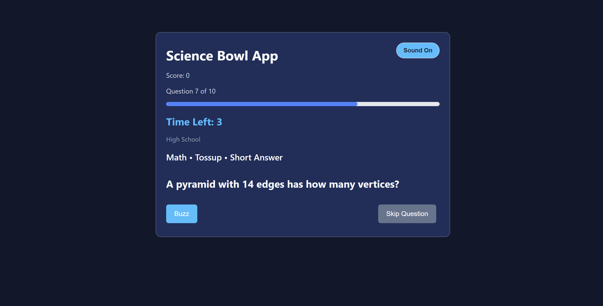
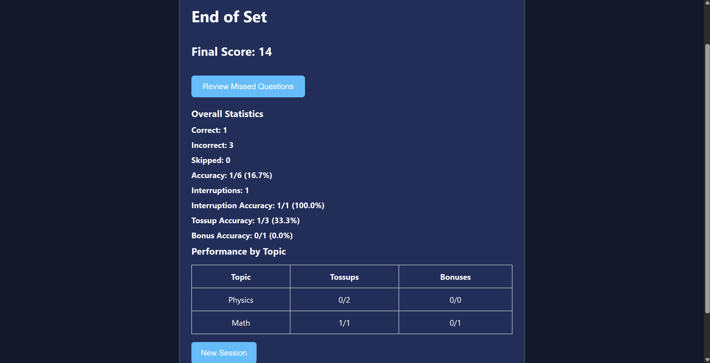
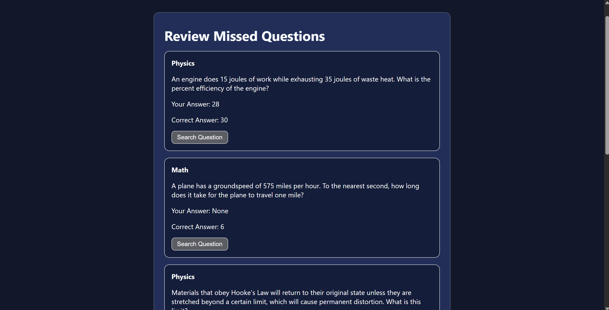

# Science Bowl Practice App

A web-based Science Bowl practice app built with React and Vite. Includes over 1000 official NSB questions with realistic tossup and bonus gameplay, speech synthesis, and session summary and analytics.

---

## Live Demo

#### [View Live Web App](https://sciencebowlpractice.vercel.app/)

---

## Gameplay

The app simulates a Science Bowl practice session using official-style tossup and bonus questions.

### Tossups
- Buzz in at any time while the question is being read
- Correct answers earn points
- Incorrect interruptions apply a penalty
- Correct tossups unlock the corresponding bonus question

### Bonuses
- Awarded after a correct tossup
- Separate timer and scoring system
- Designed to mirror real Science Bowl gameplay

### Question Modes
- Short Answer
- Multiple Choice

---

## Features

### Question Bank
- 1,000+ Science Bowl questions
- 700+ High School questions
- 350+ Middle School questions
- Physics, Chemistry, Biology, Earth Science, Energy, and Math Questions

### Practice Dashboard
- High School mode
- Middle School mode
- Combined practice mode
- Topic filtering
- Number of Questions Selection

### Question Experience
- Typewriter-style question rendering
- Text-to-speech question reading
- Keyboard shortcuts
- Search question integration
- Answer override option
- Responsive buzzer button and buzzer sound effect
- Skip Question Functionality 

### Analytics & Review
- Final score tracking
- Overall accuracy
- Tossup accuracy
- Bonus accuracy
- Interruption statistics
- Subject performance breakdowns
- Review incorrect answers

### User Experience
- Progress tracking
- Responsive layout
- Modern dashboard interface

---

## Tech Stack

### Frontend
- React
- Vite
- JavaScript
- HTML
- CSS

### APIs & Browser Features
- Web Speech API (speech synthesis)

### Deployment
- Vercel

---

## Screenshots

### Dashboard



### Practice Session



### Results Screen



### Review Page



---

## Challenges Solved

### Synchronizing Speech with Question Rendering

One of the biggest challenges was keeping text-to-speech synchronized with the typewriter effect. Questions needed to be spoken and rendered simultaneously while still allowing users to buzz in, skip questions, or move to the next question without audio continuing to play. This required careful management of React state, effects, and speech cancellation.

### Preserving Tossup-Bonus Relationships

As the question bank grew to over 1,000 questions, randomizing question order became more complex than a simple shuffle. Tossup questions needed to remain linked to their corresponding bonus questions, requiring custom logic to maintain valid tossup-bonus pairs during randomization.

### Managing Complex Game State

The application contains multiple gameplay phases, including reading, buzzing, answering, feedback, review, and retry modes. Preventing timers, keyboard shortcuts, speech synthesis, and question navigation from interfering with one another required careful state management and extensive testing.

### Scaling from a Prototype to a Large Question Bank

The project began with a small set of sample questions but eventually expanded to over 1,000 questions across multiple divisions and subjects. This required restructuring how questions were stored, filtered, selected, and validated while maintaining performance and data consistency.

### Building Meaningful Analytics

Tracking overall accuracy was straightforward, but generating useful practice statistics such as tossup accuracy, bonus accuracy, interruption accuracy, and subject-specific performance required collecting and processing gameplay data throughout each session.

---

## Installation

### Prerequisites
- Node.js
- npm

### Clone the repository:

```bash
git clone https://github.com/codeCrafter10-alt/science-bowl-practice-app.git
```

### Navigate to the project:

```bash
cd science-bowl-practice-app
```

### Install dependencies:

```bash
npm install
```

### Run the development server:

```bash
npm run dev
```
The app would run locally at http://localhost:5173

### Build for production:

```bash
npm run build
```

---

## Notes

- Questions are stored locally in JSON files and no database setup is required
- The application currently contains over 1,000 Science Bowl questions across High School and Middle School divisions.
- Speech synthesis behavior may vary slightly between browsers due to differences in Web Speech API implementations.